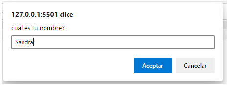
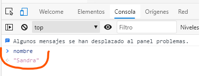

# APUNTES JS

Este apunte fue realizado con material obtenido en:
- Clases curso Desarrollo Front End - ADA 7ma.
- Notas tomadas del curso de Corseit de JS
- Notas del curso de Udemy de Fernando Herrera - Programación para principiantes
- Paginas consultadas en la web.

# Por que hice este apunte?
Cursando la certificación de FrontEnd, me encontré numerosas veces con un sentimiento de frustración y enojo, por no entender algunas cosas o no encontrar material simple.
Bueno, como no encontre un apunte con esas características... lo hice.

Este archivo inició en un word en Drive, y como ca creciendo y mutando, lo pase a este .md para poder tenerlo siempre actualizado y que este disponible para aquel que puediera necesitarlo.

### Objetivo:
Este apunte es una especie de "machete" de los conceptos principaes de JS, el A B C, para principiantes.
Para no perderse, ir ordenado y con ejemplos prácticos de algunos ejercicios.

***

# ¿Qué es JavaScript?

JavaScript se creó inicialmente para "dar vida a las páginas web". 
Existía un necesidad de generar *interacción* con el usuario.
Los *programas en este idioma se denominan scripts* . Pueden escribirse directamente en el HTML de una página web y ejecutarse automáticamente a medida que se carga la página.
Los scripts se proporcionan y ejecutan como texto sin formato. 
No necesitan preparación especial o compilación para ejecutarse.
Se lo considera un lenguaje de programación seguro. No proporciona acceso de bajo nivel a la memoria o la CPU, ya que se creó inicialmente para navegadores que no lo requieren.

## ¿Qué hace que JavaScript sea único?
Hay al menos tres cosas buenas sobre JavaScript:
- Integración completa con HTML / CSS.
- Las cosas sencillas se hacen de forma sencilla.
- Compatible con todos los navegadores principales y habilitado de forma predeterminada.

## Características:
- Débilmente tipado
- Interpretado
- Dinámico
- Secuencial: lee las instrucciones en orden de arriba hacia abajo.

## Formas de vincular HTML con JS:

1. Dentro de un archivo HTML una etiqueta  indica un cambio de lenguaje, todo lo que esté dentro de ella estará en JS, se coloca dentro del body y 🚫 no se anidan 🚫.
~~~
<!DOCTYPE html>
<html lang="en">
<head>
    <meta charset="UTF-8">
    <meta http-equiv="X-UA-Compatible" content="IE=edge">
    <meta name="viewport" content="width=device-width, initial-scale=1.0">
    <title>Document</title>
</head>
<body>
    
    
</body>
</html>
~~~
2. Tambien se puede linkear el index.html con un archivo app.js externo mediante el atributo src.
El archivo app.js tiene que estar en la misma carpeta que el html, o si esta por fuera indicar la ruta que corresponda.

~~~
<!DOCTYPE html>
<html lang="en">
<head>
    <meta charset="UTF-8">
    <meta http-equiv="X-UA-Compatible" content="IE=edge">
    <meta name="viewport" content="width=device-width, initial-scale=1.0">
    <title>Document</title>
</head>
<body>
    
    
    
</body>
</html>
~~~

# Todo lo que se escriba en JS puede leerse en la “consola”.
¿Cómo?
Abriendo el archivo HTML con live server, haciendo click derecho “Inspeccionar”:

¿Cómo escribí ese código en JS?
~~~

~~~
La instrucción 
~~~
console.log()
~~~
te permite ver lo que escribiste entre paréntesis (luego vemos qué tipo de dato es).
y si no lo quiero ver en la consola?🤔
~~~

~~~
La instrucción
~~~
alert()
~~~
muestra un mensaje en el browser:

Otra instrucción muy común es 
~~~
prompt, 
~~~
¿que hace? ❓
Abre un cuadro de diálogo con el usuario, donde le puedo hacer una pregunta, y su respuesta se convierte en un “dato”.
Pero el ~~~prompt~~~ no guarda el dato en ninguna parte, entonces le haría una pregunta a un usuario y luego no podría utilizar ese dato que me dio su respuesta?🤔
🔴para eso vamos a utilizar las 
# 🚩VARIABLES🚩
Ejemplo:
~~~

~~~

En el ejemplo anterior si el usuario me responde su nombre, si no lo tengo almacenado en una VARIABLE, lo pierdo, entonces:
~~~

~~~

Puedo verlo en la consola:

Para entender esto 👆 tenemos que entender lo que es una *VARIABLE*:
Es un *espacio de memoria* (como una cajita 📦) donde se almacenan distintos tipos de datos.
Siempre tiene un *nombre que las identifica* que debe ser unico.
Se las puede llamar de 3 formas:
* var : en desuso
* let: puede cambiar su valor (ejemplo del nombre, si entra otro usuario, el nombre va a ser otro).
* const: no puede cambiar su valor.

Declarar e inicializar una variable es asignarle: 
* Nombre (declarar)
* Valor (entiéndase valor al dato que va a guardar) -> (inicializar)

Ejemplo:
~~~

~~~

En este caso el nombre de la variable es “nombre” y el valor es “Sandra”. 
Como se que el valor es ese? porque con el *signo =* se le asignan valor a las variables, se lo llama *OPERADOR DE ASIGNACIÓN*.

Cada vez que se termina de declarar una sentencia para cerrarla se debe colocar un punto y coma ( ; ) ❗❗❗

Las variables se pueden declarar todas en una misma línea separadas por comas:
~~~

~~~

En este ejemplo hay 3 variables: nombre, edad, nacionalidad.
Y los valores son: “Sandra”, 42, “argentina”.
🤪 por que “Sandra” y “argentina” están entre comillas y 42 no???? 👀
Porque todo lo que es texto va entre comillas, lo que es número no  ❗❗❗ y esto es así porque esos datos son de distinto *TIPO*.

# La importancia del nombre de la variables:
* Su nombre tiene que representar a los datos que almacena.
* Debe ser legibles por humanos.
* Evitar usar abreviaturas o letras sueltas.
* Tenga en cuenta las definiciones de su equipo de conceptos básicos y atengase a ellas, ejemplo: Usuario = user.
* Caracteres disponibles: letras del alfabeto, menos la ñ; números, $, guión bajo.
* No pueden iniciar con un número.
* JS tiene palabras reservadas que no se pueden utilizar para nombrar variables, ej: *if, for, function*.

# Formas de escribir una variable:
* camelCase: primera letra en min y la primer letra de la segunda palabra en MAY.
* snake_case: palabras separadas por un guion bajo
* PascalCase: primer letra de la primer palabra en MAY y primer letra de la segunda palabra en MAY.

