# APUNTES JS 📚

Este apunte fue realizado con material obtenido en:
- Clases curso Desarrollo Front End - ADA 7ma.
- Notas tomadas del curso de Corseit de JS
- Notas del curso de Udemy de Fernando Herrera - Programación para principiantes
- Paginas consultadas en la web.

## Por que hice este apunte❓
Cursando la certificación de FrontEnd, me encontré numerosas veces con un sentimiento de frustración y enojo, por no entender algunas cosas o no encontrar material simple.
Bueno, como no encontre un apunte con esas características... lo hice.

Este archivo inició en un Word en Drive, y como ca creciendo y mutando, lo pase a este .md para poder tenerlo siempre actualizado y que este disponible para aquel que puediera necesitarlo.

## Objetivo🎯
Este apunte es una especie de "machete" de los conceptos principaes de JS, el A B C, para principiantes.
Para no perderse, ir ordenado y con ejemplos prácticos de algunos ejercicios.

## INDICE 📑
* [INTRO:](#intro)
- Que es JS?
- Características
- Formas de vincular HTML y JS

* [INSTRUCCIONES BÁSICAS:](#instrucciones)
- console.log
- alert

* [VARIABLES](#variables)
* [Como nombrar una variable?](#nombre_variable)
* [TIPOS DE DATOS](#tipo_dato)
    - Strings
    - Numbrer
    - Boolean
    - Undefined
    - Null
    - Nan
    - Que comillas usar?

* [CONCATENAR](#concat)
* [OPERADORES MATEMATICOS](#op_mat)
* [OBJETOS](#objetos)
* [ARRAYS](#arrays)
* [ESTRUCTURAS DE CONTROL](#control)
    - if
    - else if
    - else
    - Operadores de comparación
    - Operadores Lógicos

* [SWITCH](#switch)
***

# ¿Qué es JavaScript?

JavaScript se creó inicialmente para "dar vida a las páginas web". 
Existía un necesidad de generar *interacción* con el usuario.
Los *programas en este idioma se denominan scripts* . Pueden escribirse directamente en el HTML de una página web y ejecutarse automáticamente a medida que se carga la página.
Los scripts se proporcionan y ejecutan como texto sin formato. 
No necesitan preparación especial o compilación para ejecutarse.
Se lo considera un lenguaje de programación seguro. No proporciona acceso de bajo nivel a la memoria o la CPU, ya que se creó inicialmente para navegadores que no lo requieren.

## ¿Qué hace que JavaScript sea único?
Hay al menos tres cosas buenas sobre JavaScript:
- Integración completa con HTML / CSS.
- Las cosas sencillas se hacen de forma sencilla.
- Compatible con todos los navegadores principales y habilitado de forma predeterminada.

## Características:
- Débilmente tipado
- Interpretado
- Dinámico
- Secuencial: lee las instrucciones en orden de arriba hacia abajo.

## Formas de vincular HTML con JS:

1. Dentro de un archivo HTML una etiqueta  indica un cambio de lenguaje, todo lo que esté dentro de ella estará en JS, se coloca dentro del body y 🚫 no se anidan 🚫.
~~~
<!DOCTYPE html>
<html lang="en">
<head>
    <meta charset="UTF-8">
    <meta http-equiv="X-UA-Compatible" content="IE=edge">
    <meta name="viewport" content="width=device-width, initial-scale=1.0">
    <title>Document</title>
</head>
<body>
    
    
</body>
</html>
~~~
2. Tambien se puede linkear el index.html con un archivo app.js externo mediante el atributo src.
El archivo app.js tiene que estar en la misma carpeta que el html, o si esta por fuera indicar la ruta que corresponda.

~~~
<!DOCTYPE html>
<html lang="en">
<head>
    <meta charset="UTF-8">
    <meta http-equiv="X-UA-Compatible" content="IE=edge">
    <meta name="viewport" content="width=device-width, initial-scale=1.0">
    <title>Document</title>
</head>
<body>
    
    
    
</body>
</html>
~~~

### Todo lo que se escriba en JS puede leerse en la “consola”.
¿Cómo?
Abriendo el archivo HTML con live server, haciendo click derecho “Inspeccionar”:
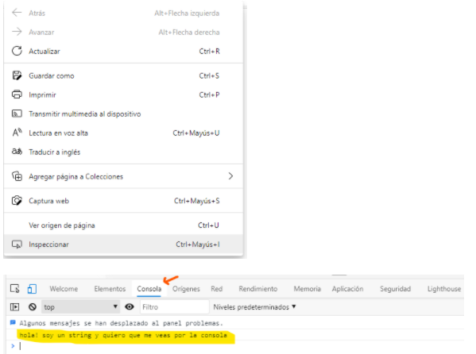

¿Cómo escribí ese código en JS?
~~~

~~~
La instrucción 
~~~
console.log()
~~~
te permite ver lo que escribiste entre paréntesis (luego vemos qué tipo de dato es).

Y si no lo quiero ver en la consola?🤔
~~~

~~~
La instrucción
~~~
alert()
~~~
muestra un mensaje en el browser:
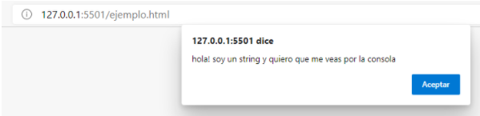

Otra instrucción muy común es 
~~~
prompt, 
~~~
que hace❓
Abre un cuadro de diálogo con el usuario, donde le puedo hacer una pregunta, y su respuesta se convierte en un “dato”.
Pero el *prompt* no guarda el dato en ninguna parte, entonces... le haría una pregunta a un usuario y luego no podría utilizar ese dato que me dio en su respuesta?🤔

🔴para eso vamos a utilizar las:

### VARIABLES
Ejemplo:
~~~

~~~
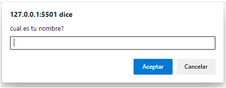

En el ejemplo anterior si el usuario me responde su nombre, si no lo tengo almacenado en una VARIABLE, lo pierdo, entonces:
~~~

~~~

Puedo verlo en la consola:
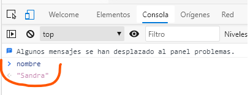

Para entender esto 👆 tenemos que entender lo que es una
🚩VARIABLE🚩

Es un *espacio de memoria* (como una cajita 📦) donde se almacenan distintos tipos de datos.

Siempre tiene un *nombre que las identifica* que debe ser unico.

Se las puede llamar de 3 formas:
* var : en desuso
* let: puede cambiar su valor (ejemplo del nombre, si entra otro usuario, el nombre va a ser otro).
* const: no puede cambiar su valor.

Declarar e inicializar una variable es asignarle: 
* Nombre (declarar)
* Valor (entiéndase valor al dato que va a guardar) -> (inicializar)

Ejemplo:
~~~

~~~

En este caso el nombre de la variable es “nombre” y el valor es “Sandra”. 
Como se que el valor es ese? porque con el *signo =* se le asignan valor a las variables, se lo llama *OPERADOR DE ASIGNACIÓN*.

Cada vez que se termina de declarar una sentencia para cerrarla se debe colocar un punto y coma ( ; ) ❗❗❗

Las variables se pueden declarar todas en una misma línea separadas por comas:
~~~

~~~

En este ejemplo hay 3 variables: nombre, edad, nacionalidad.
Y los valores son: “Sandra”, 42, “argentina”.

🤪 por que “Sandra” y “argentina” están entre comillas y 42 no???? 👀

Porque todo lo que es *TEXTO ó STRING va entre comillas*, lo que es *NÚMERO* no  ❗❗❗ y esto es así porque esos datos son de distinto *TIPO*.

### La importancia del nombre de la variables:
* Su nombre tiene que representar a los datos que almacena.
* Debe ser legibles por humanos.
* Evitar usar abreviaturas o letras sueltas.
* Tenga en cuenta las definiciones de su equipo de conceptos básicos y atengase a ellas, ejemplo: Usuario = user.
* Caracteres disponibles: letras del alfabeto, menos la ñ; números, $, guión bajo.
* No pueden iniciar con un número.
* JS tiene palabras reservadas que no se pueden utilizar para nombrar variables, ej: *if, for, function*.

### Formas de escribir una variable:
* camelCase: primera letra en min y la primer letra de la segunda palabra en MAY.
* snake_case: palabras separadas por un guion bajo
* PascalCase: primer letra de la primer palabra en MAY y primer letra de la segunda palabra en MAY.

## TIPOS DE DATOS:

* **STRINGS**: cadena de texto
~~~

~~~

* **NÚMEROS**:
~~~

~~~

El número va 👀SIEMPRE SIN COMILLAS👀, en el segundo caso lo interpreta como texto.

Los números pueden ser:

* Positivos
* Negativos
* Decimales
* Con ellos se pueden realizar operaciones matemáticas ➕➖➗✖

* **BOOLEAN**: valor “true” y “false”.✔❌
* **UNDEFINED**: indefinido, declarar una variable y no asignarle ningún valor.
~~~

~~~
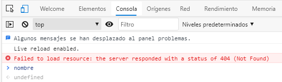

* **NULL**: nulo = valor especial que representa "nada", "vacío" o "valor desconocido.
* **NAN**: not a number, cuando queremos realizar una operación matemática con un dato que no es un número.

### COMILLAS PARA DECLARAR UNA VARIABLE:
Se pueden usar:
* comillas dobles: “ ”  let nombre = “Sandra”;
* comillas simples: ‘ ‘   let nombre = ‘Sandra’; (alt+39)
* backticks: ` ` let nombre = `Sandra`; (alt+96)
Las backticks se utilizan para una forma particular de *CONCATENAR*.

### Que es CONCATENAR?:
Unir dos o más cadenas de texto y datos.
Se puede concatenar con el signo + (opción 1), o utilizando ` ` y ${} (opción2)
Ejemplo:

1. 
~~~
let nombre = "Sandra";
let apellido = "Muraca";
let edad = 42;
 
alert ("hola soy" + nombre + "" + apellido + "y tengo" + edad + "" + "soy argentina y estudio programación");
~~~

2. 
~~~
let nombre = "Sandra";
let apellido = "Muraca";
let edad = 42;
 
alert (`hola soy ${nombre} ${apellido}y tengo ${edad} soy argentina y estudio programación`);
~~~

El resultado de ambas opciones es el mismo:

### OPERADORES MATEMÁTICOS:
Para realizar operaciones matemáticas utilizamos los siguientes signos:

(+) SUMA
(-) RESTA
(/) DIVISIÓN
(*) MULTIPLICACIÓN
(%) RESTO

Existen otros operadores, como el de potenciación, decremento e incremento.

### Links a Ejercicios con los conceptos vistos 🏋️‍♀️:
* [Introducción a JS](https://github.com/sandramuraca/introduccionJS)
* [Variables, Datos, Operadores](https://github.com/sandramuraca/VARIABLES_OPERADORES_DATOS)
***

🚩OBJETOS🚩

En construcción 🔧🔨🛠⚙

🚩ARRAYS🚩

Es una lista de elementos, que  tienen relación entre sí. 
Se escriben entre corchetes [] → es un tipo de OBJETO.
Es una forma de agrupar elementos (de cualquier tipo).
Ejemplo:
Array FAMILY es el agrupamiento de las variables de cada integrante de la familia👇
~~~
const person1 = {
            name: `Sandra`,
            surname: `Muraca`,
            age: 42 
        };
 
        const person2 = {
            name: `Victoria`,
            surname: `Capella`,
            age: 13 
        };
 
        const person3 = {
            name: `Cristian`,
            surname: `Rodriguez`,
            age: 40
        };
 
        const family = [person1, person2, person3]
~~~

Los arrays tienen **“índices”** que es la posición de cada elemento que agrupa, el indice siempre arranca en 0.
Ejemplo:
~~~
console.log (family); // aca en el console muestra los 3 elementos con su nro indice
~~~
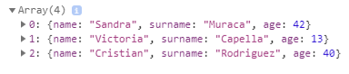

El elemento 0 de este array es “Sandra” y así sucesivamente.

~~~
console.log (family[0]); // aca llamamos al elemento, con todos us componentes, indicado con el nro entre corchetes según el indice
~~~
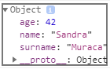

Ese índice se utiliza para llamar a cualquiera de esos elementos desde la consola según su numeración.
En los arrays importa el orden de los elementos.
El potencial del arrays está con los **MÉTODOS** que viene por default con JS → son funcionalidades previamente programadas, el más utilizado es “push” →
nombreDeLaVariable.push()

~~~
 family.push({
            name: `gata`,
            surname: `flora`,
            age: 7
        }) 
        /// de esta manera se agregan elementos dinamicos al array
~~~

luego de haber agregado un elemeto más al array, se hacemos console.log:

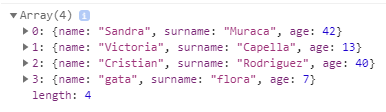

### 🚩ESTRUCTURAS DE CONTROL🚩

* Podemos controlar el flujo del código y cómo queremos que se ejecute según se cumplan o no algunas condiciones.
* Se denominan *CONDICIONALES*:
    * if
    * else if
    * else

* **if**: (si entonces) espera una condición **true** para ejecutar el código, si es **false** las instrucciones no se ejecutan y el programa sigue su flujo.

~~~
 let numero = 2;
        if (numero >= 2) {
            alert("El numero es mayor o igual a 2");
        }

~~~
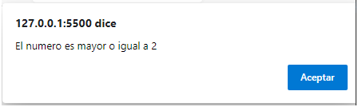

* **else** (si no) permite controlar que pasa si la condición es falsa, no necesita ningún parámetro, por que se ejecuta cuando el parametro declarado en if es  false.

~~~
   let numero = 1;
        if (numero >= 2) {
            alert("El numero es mayor o igual a 2");
        } else {
            alert ("el número no es mayor o igual a 2");
        }
~~~
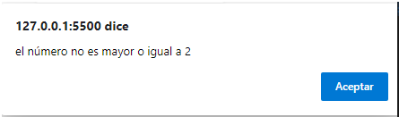

* **else if** (si entonces si) en el tercer camino, es una contra condición.

~~~
// este es un condicional de mas de 2 caminos
        const age = 80;
 
        if (age >= 65) {
            console.log(`soy jubilado`);
        } else if (age >= 18 && age < 65){
            console.log(`soy mayor de edad`);
        } else {
            console.log(`soy menor de edad`);
        }
~~~

Con los **condicionales** se utilizan en los parámetros los **OPERADORES DE COMPARACIÓN**:

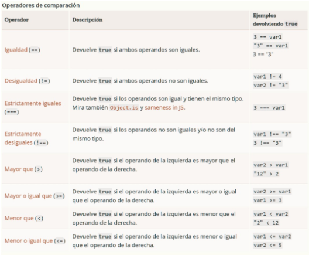

y también los **OPERADORES LÓGICOS**:

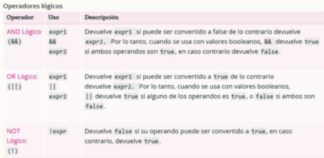

(|| operador barra vertical= alt + 124)

### DFD DE UNA ESTRUCTURA DE CONTROL DE 2 CAMINOS:
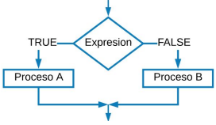

💡 LOS CONDICIONALES PERMITEN TOMAR DECISIONES RESPECTO DE QUÉ CAMINO VA A TOMAR MI CODIGO SI PASA UNA COSA U OTRA.

🚩SWITCH🚩

Forma de anidamiento de múltiples expresiones IF, ELSE IF, ELSE.
Su uso no siempre es necesario resulta útil para introducir eficiencia y claridad al código.
En su contenido se quiere evaluar. 
Ejemplo:
~~~
let diaDeLaSemana = Number(prompt ("Ingrese un número, le diremos a que dia de la semana corresponde"));
 
        switch (diaDeLaSemana) {
            case 1:
                alert ("Es lunes");
                break;
            case 2:
                alert ("Es martes");
                break;
            case 3:
                alert ("Es miercoles");
                break;
            case 4:
                alert ("Es jueves");
                break;
            case 5:
                alert ("Es Viernes");
                break;
            default:
                alert ("no ha ingresado un numero valido");
                break;
        }
~~~

El default es opcional, son las instrucciones que se ejecutan si no se verifican ninguno de los casos evaluados.

